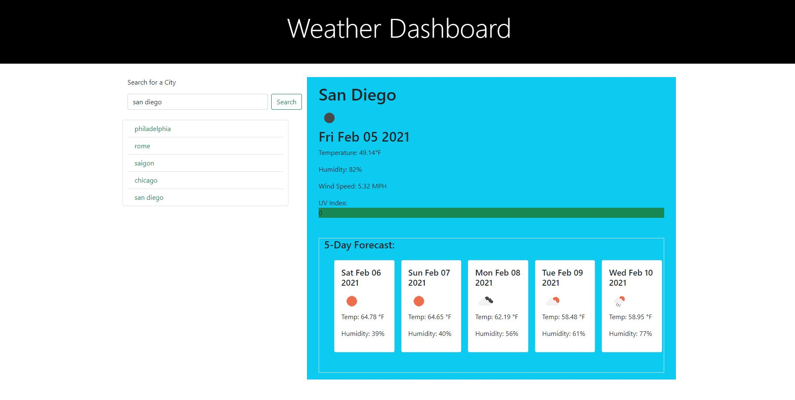

# Weather Dashboard  
___

## Objective
Using [OpenWeather API] (https://openweathermap.org/api), weather dashboard is able to provide user the current temperature of their input city. In addition, this weather app is able to display the upcoming 5-day forecast.  Current weather conditions display will give user city name, icon to indicate current condition, current date (using Luxon to convert info from openweather API), temperature, humidity %, wind speed and UV-index. UV-Index will be color coded to identify: favorable (green), moderate (yellow), or severe (red). The future forecast will display 5 upcoming days with date, icon, temperature, and humidity. Entered city will be stored and display below search box for easy access. User can click on searched city and dashboard will recall its current and future weather conditions. When app first loaded or refresh, information will be cleared out and main display will prompt user to enter a city. 
___

## Layout: index.html
The HTML file is powered by Bootstrap. Using expired Jumbotron with small tweak in personal css. Design to the most minimum concept. The main consist of 1 row with 2 columns (col-4 and col-8). 
- The first column contain form for search bar and button. In addition. When user enter city, it will dynamically attach below for later call back. 
- The second column included 2 column with in itself. The first top will display prompt for user to input city when the page is first loaded or refresh. Once the city is enter and searched, this section will display current conditions. The bottom will then display the future weather which is also dynamically attach. 

___
## Layout: style.css
The CSS file is giving the HTML small changes to margin and added feature for jumbotron which no long resided in bootstrap 4.

___
## Layout: script.js
The JavaScript code is powered by jQuery with 2 functions and a click event. First, all functions is wrapped inside document ready to ensure info will be run when the page is loaded.  It then will run the city that is stored in local storage. If the local storage is empty. A Prompt will start asking user to search for a city.   When search button is click, preventdefault() function is run to prevent default in browser that clear out information entered by  the user. Once the information is capture to city variable it then get trim() to get rid of any unnessesary empty space. City then get pushed to an empty array testCity. A name ‘task’ is then set and stringify in order for local storage to store and recall later.  Variable is set to searchHistory to recall from local storage with parse to covert back to array. Then a For loop will run and capture this array and display city name in searched history for user to click and recall their search. This event will also run searchWeather function at the end to display all the information captured.  The searchWeather(name) function retrieved information from openweather API. However in order to display the information in Fahrenheit, units=imperial is added to convert from Kelvin to Fahrenheit. It fetch the information for current weather condition as well as latitude and longitude for the city that was entered. And run the second function getForecast which will be describe later. It then used the info that is capture and display the date using Luxon to convert the string. City Name, temperature, weather condition icon, humility and wind speed is created and ready to display when the function is call.  One important step is to empty out the display before append any new information to ensure none repeat data. Second, getForecast() is generated . This function is use to request information from openweather One Call API. It utilized the latitude and longitude capture from the prior searchWeather function to search for the entered city and captured 8 days forecast as well as UV-index.  Since the result is 8 days future forecast and only 5 is needed , for loop is being used to start capture the next day display which statrt the initial index at 1 instead of 0 and have it less than 5 as a condition to capture 5-day forecast. Once the information is captured and ready to append, this function will run when searchWeather is run.  
___
## Summary
Weather information is unarguably one of the more important piece of information for everyone across the world. There are many different method one can utilize to view. With the invention of smartphone, this information is now readily available at your finger tip. This assignment was very challenging. I spend two days unable to storage information to local storage as well as not able to display weather condition icon. I found myself searching various resources including office hours with TAs and tutor to complete this project on time. In hindsight, I would have start with pseudo coded better in the beginning, pay more attention to src “”, instead of scr””, and create the cards in index page instead of dynamically generate them. 

## Application Links and Images  
**Links:**  
Application link: (https://vinhkhamhuynh.github.io/weather-dashboard)  
Github link:  (https://github.com/vinhkhamhuynh/weather-dashboard)

  
